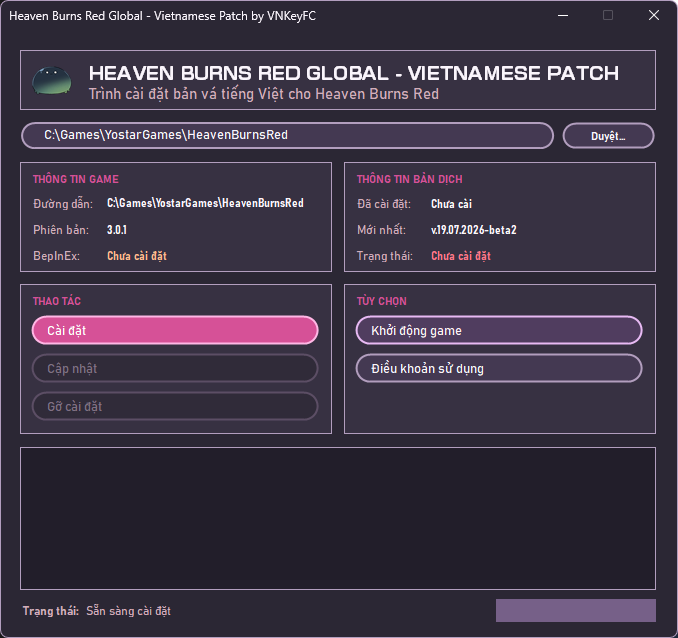

<h1>HBR VN Patch Installer</h1>

  Trình cài đặt bản Việt hóa không chính thức dành cho phiên bản quốc tế của <strong>Heaven Burns Red</strong>.

## Giới thiệu

HBR VN Patch Installer giúp người dùng cài đặt, cập nhật và gỡ bản Việt hóa Heaven Burns Red thông qua giao diện Windows. Chương trình tự nhận diện thư mục game, kiểm tra phiên bản patch mới nhất trên GitHub Releases và tải gói cài đặt phù hợp.

Bản Việt hóa được phát triển bởi **Vietnam Key FanClub** và phát hành tại [HBR-EN_VN-Patch](https://github.com/vnkeyfc/HBR-EN_VN-Patch/releases).

## Giao diện

  

## Tính năng

- Tự động nhận diện thư mục cài đặt Heaven Burns Red.
- Cho phép chọn thủ công thư mục game khi cần thiết.
- Hiển thị phiên bản game và phiên bản bản Việt hóa đang sử dụng.
- Tự động kiểm tra phiên bản bản Việt hóa mới nhất.
- Chỉ bật nút **Cập nhật** khi có phiên bản mới.
- Tải và cài đặt bản Việt hóa trực tiếp trong ứng dụng.
- Hiển thị tiến trình và trạng thái trong suốt quá trình cài đặt.
- Hỗ trợ cài đặt, cập nhật, gỡ cài đặt và khởi chạy game.

## Yêu cầu

- Windows 10 hoặc Windows 11 64-bit.
- Phiên bản quốc tế của Heaven Burns Red đã được cài đặt.
- Kết nối Internet để kiểm tra và tải patch từ GitHub Releases.

## Sử dụng

1. Tải phiên bản mới nhất từ mục [Releases](https://github.com/quon-croissant/HBR-VN-Patch-Installer/releases).
2. Chạy `HBR-VN-Patch-Installer.exe`.
3. Kiểm tra đường dẫn game được chương trình nhận diện hoặc nhấn **Duyệt...** để chọn thủ công.
4. Nhấn **Cài đặt**, đọc và chấp nhận Điều khoản sử dụng.
5. Chờ chương trình tải và giải nén bản Việt hóa.
6. Nhấn **Khởi chạy game** sau khi cài đặt hoàn tất.

## Cập nhật

Khi mở chương trình, installer sẽ tự kiểm tra phiên bản bản Việt hóa mới nhất. Nếu có bản mới, nút **Cập nhật** sẽ được bật; nếu đang dùng phiên bản mới nhất, nút này sẽ được khóa.

## Gỡ cài đặt

Chọn **Gỡ cài đặt** trên giao diện và xác nhận để xóa toàn bộ bản Việt hóa khỏi game.

> ⚠️
> Thao tác này cũng sẽ xóa toàn bộ mod và plugin khác đang được cài trong game. Hãy sao lưu chúng trước nếu muốn tiếp tục sử dụng.

Tài khoản và dữ liệu lưu của người chơi không bị ảnh hưởng.

## Miễn trừ trách nhiệm

Đây là dự án do cộng đồng thực hiện và không liên kết, đại diện hoặc được xác nhận bởi Wright Flyer Studios, Key, Visual Arts hoặc Yostar.

Heaven Burns Red cùng toàn bộ tên gọi, hình ảnh và tài sản liên quan thuộc về các chủ sở hữu tương ứng.
